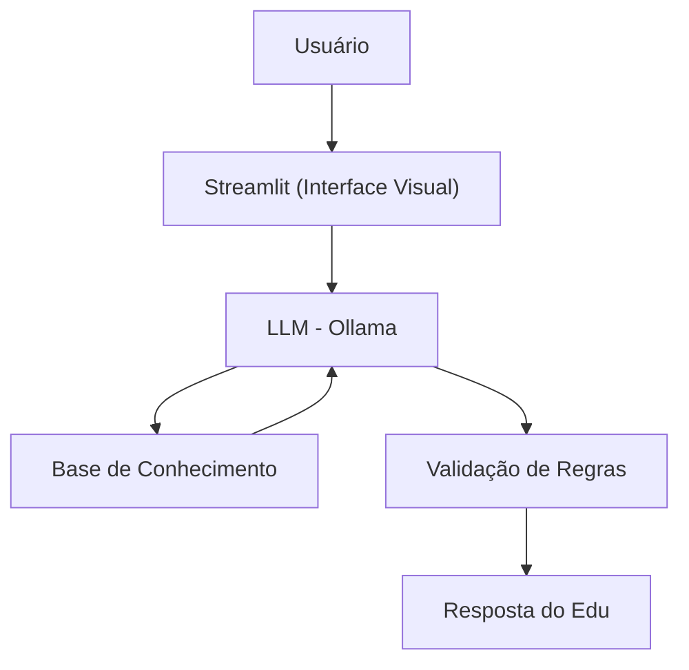

# 🎓 Edu: Educador Financeiro IA

O **Edu** é um assistente de Inteligência Artificial desenvolvido para ensinar finanças pessoais de forma didática e personalizada. O agente utiliza dados históricos e perfis de usuários para criar exemplos práticos, ajudando na compreensão de conceitos financeiros sem realizar recomendações de investimento.

---

## 📝 Caso de Uso

### Problema
Muitas pessoas têm dificuldade em entender conceitos básicos de finanças pessoais, como reserva de emergência, tipos de investimentos e organização de gastos.

### Solução
Um agente educativo que explica conceitos financeiros de forma simples, usando os dados do próprio cliente como exemplo prático, mas sem dar recomendações de investimento.

### Público-Alvo
Pessoas iniciantes em finanças pessoais que querem aprender a organizar suas finanças.

---

## 🤖 Persona e Tom de Voz

* **Nome:** Edu (Educador Financeiro)
* **Personalidade:** Educativo, paciente e amigável. Nunca julga os gastos do cliente.
* **Tom de Voz:** Informal, acessível e didático.
* **Exemplos de Linguagem:**
    * *Saudação:* "Olá! Sou o Edu, seu educador financeiro. Como posso te ajudar a aprender hoje?"
    * *Limitação:* "Não posso recomendar onde investir, mas posso te explicar como cada tipo de investimento funciona."

---

## ⚙️ Arquitetura do Sistema




### Componentes Técnicos

| Componente | Tecnologia |
| --- | --- |
| **Interface** | [Streamlit](https://streamlit.io/) |
| **LLM** | Ollama (Local) |
| **Processamento de Dados** | Pandas |

---

## 📊 Base de Conhecimento (Dados do Projeto)

O agente baseia-se em quatro fontes de dados principais para contextualizar as respostas:

### 1. Perfil do Investidor (`perfil_investidor.json`)

```json
{
  "nome": "João Silva",
  "idade": 32,
  "profissao": "Analista de Sistemas",
  "renda_mensal": 5000.00,
  "perfil_investidor": "moderado",
  "objetivo_principal": "Construir reserva de emergência",
  "patrimonio_total": 15000.00,
  "reserva_emergencia_atual": 10000.00,
  "aceita_risco": false,
  "metas": [
    {
      "meta": "Completar reserva de emergência",
      "valor_necessario": 15000.00,
      "prazo": "2026-06"
    }
  ]
}

```

### 2. Transações Recentes (`transacoes.csv`)

| Data | Categoria | Valor | Tipo |
| --- | --- | --- | --- |
| 2024-01-10 | Lazer | 150.00 | Despesa |
| 2024-01-12 | Salário | 5000.00 | Receita |
| 2024-01-15 | Educação | 300.00 | Despesa |

### 3. Histórico de Atendimento (`historico_atendimento.csv`)

| Data | Assunto | Resumo |
| --- | --- | --- |
| 2023-12-01 | Reserva de Emergência | Explicado o conceito de 6 meses de gastos. |
| 2023-12-15 | Juros Compostos | Analogia da bola de neve aplicada à reserva. |

---

## 🛡️ Segurança e Anti-Alucinação

* **Contexto Estrito:** O agente utiliza apenas os dados fornecidos nos arquivos acima.
* **Sem Recomendações:** O Edu explica **como** os produtos funcionam, mas **nunca** indica qual comprar.
* **Limitações:**
* NÃO acessa senhas ou dados bancários reais.
* NÃO substitui um consultor financeiro certificado (CFA/Ancord).
* Se não houver dados, o agente admite o desconhecimento.


---

## 🚀 Como Executar

1. Certifique-se de ter o **Ollama** instalado.
2. Instale as dependências:
```bash
pip install streamlit pandas requests

```


3. Rode a aplicação:
```bash
streamlit run app.py

```
